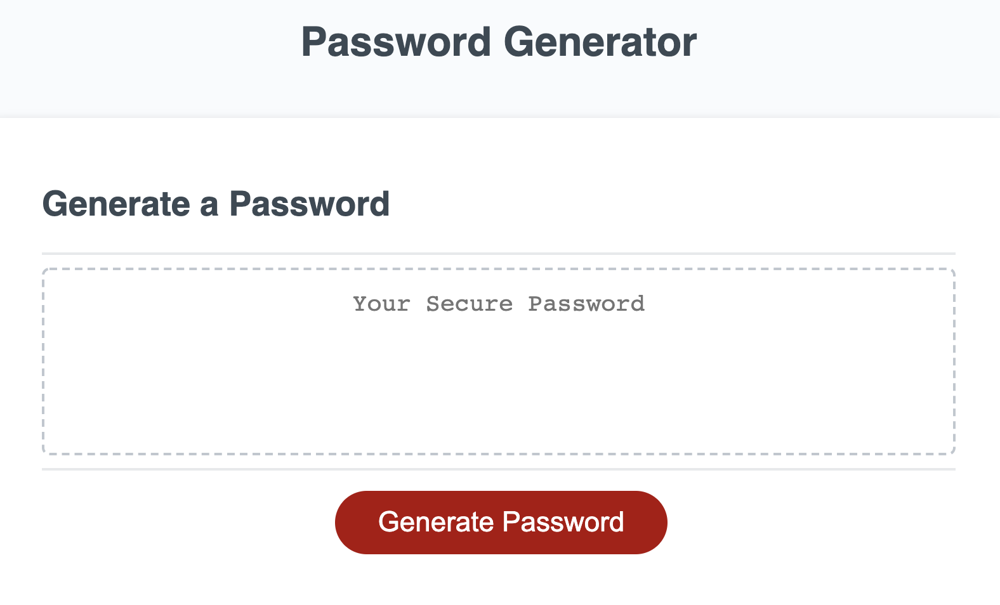
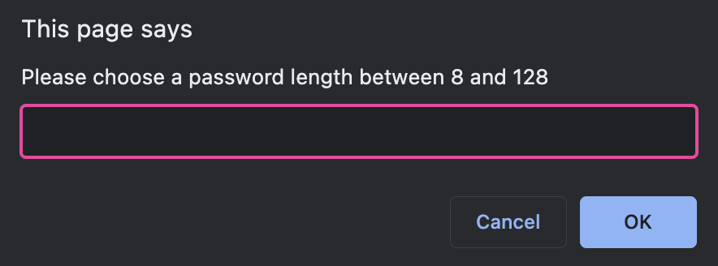
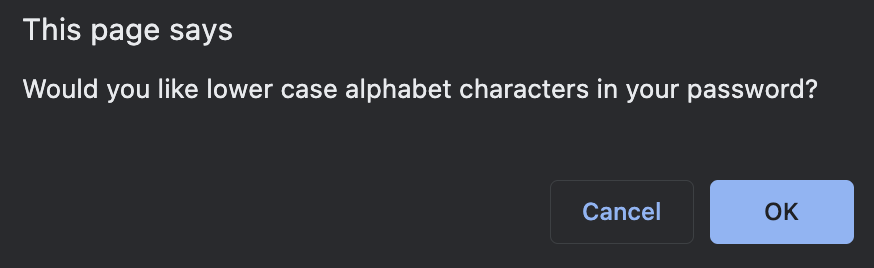
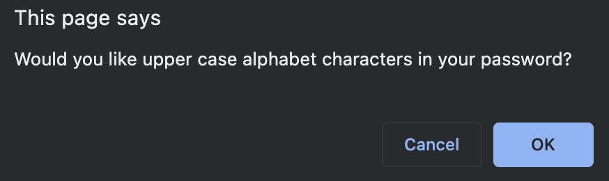
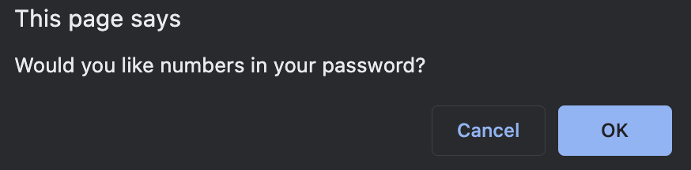
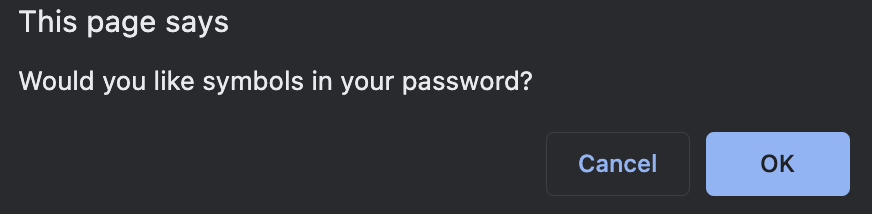
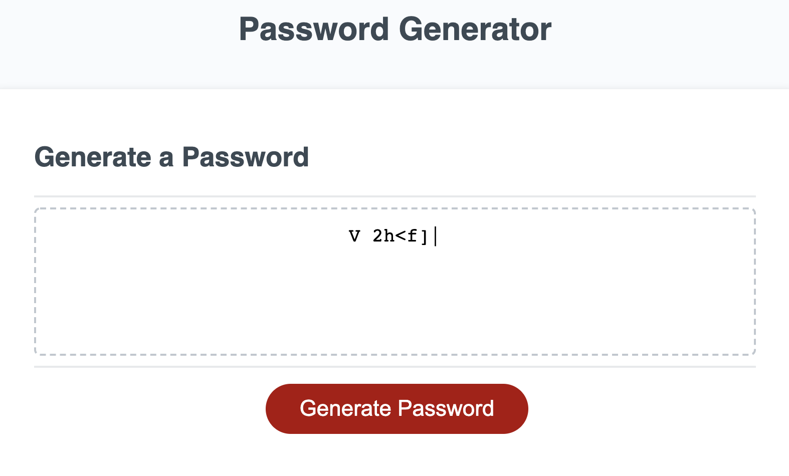

# Password-Generator

## Description

Created this application to be able to further develop my JavaScript coding skills.

This application enables people to generate random passwords based on criteria that they've selected (includes length of the password, as well as characters included). The option given to the user allows them to modify the password addresses a need for a strong password that provides greater security.

## Access

The following link: https://sophiekdj.github.io/Password-Generator/

## Usage

When the page is first loaded it will look like this:

Once you click on the "Generate Password" button you will be given a series of prompts:

Then based on the prompts you choose, the application will generate a password just like this one:

